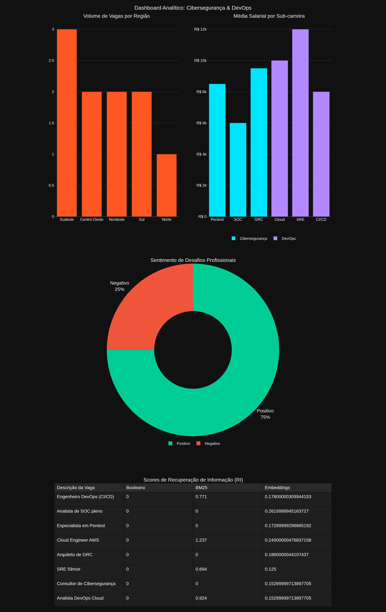

## Introdução

O mercado de tecnologia tem passado por uma transformação significativa nos últimos anos, migrando de uma demanda massiva por desenvolvimento de software genérico para a especialização em nichos de alta criticidade. Dentre estes, Cibersegurança e DevOps destacam-se como pilares fundamentais para a garantia de resiliência, escalabilidade e proteção de dados nas operações corporativas modernas. A crescente complexidade das ameaças digitais e a necessidade de entregas contínuas e automatizadas tornam esses profissionais peças-chave no ecossistema tecnológico atual.

Para compreender a fundo essa dinâmica de mercado, foi realizada uma ampla extração e análise de dados provenientes de fontes diversificadas, como LinkedIn, CIEE e Jobbol. Essa abordagem multiplataforma permitiu capturar desde oportunidades de estágio até posições sêniores de engenharia e arquitetura, oferecendo uma visão panorâmica e realista sobre o volume de vagas, a remuneração média e os principais desafios enfrentados pelos profissionais destas áreas de infraestrutura.

## Requisições do Mercado

A partir da aplicação de técnicas de Processamento de Linguagem Natural (NLP) sobre as descrições das vagas, foi possível extrair a frequência das principais habilidades exigidas pelo mercado. A análise do gráfico de requisições revela que ferramentas de orquestração de contêineres e fundamentos de sistemas operacionais dominam os requisitos das vagas. O domínio de tecnologias como Kubernetes, Docker, Linux e provedores de nuvem pública (AWS) tornou-se mandatório, evidenciando uma transição de profissionais puramente focados em código para especialistas capazes de projetar, automatizar e proteger infraestruturas complexas e distribuídas.

## Motores de Recuperação de Informação (RI)

A eficiência na localização de oportunidades adequadas depende diretamente do motor de busca utilizado. Na análise, avaliamos três abordagens distintas de Recuperação de Informação:

*   **Score Booleano:** É o modelo mais elementar de RI, baseado na teoria de conjuntos. Ele calcula a relevância através da presença ou ausência exata dos termos da consulta (*query*) no documento. Se a palavra exata não estiver no texto, o documento é sumariamente ignorado, sem meio-termo ou cálculo de similaridade semântica.
*   **Score BM25 (Best Matching 25):** Representa o estado da arte dos modelos probabilísticos baseados em frequência de termos (TF-IDF). Ele não apenas verifica a presença da palavra-chave, mas também pondera a frequência com que o termo aparece no documento em relação à sua raridade em toda a coleção de vagas, penalizando documentos excessivamente longos para manter a precisão do ranqueamento.
*   **Score de Embeddings:** Utiliza redes neurais profundas (arquitetura Transformer) para converter textos e consultas em vetores matemáticos densos em um espaço n-dimensional. A relevância é calculada pela similaridade do cosseno entre os vetores. Este modelo não busca correspondência exata de palavras, mas sim a similaridade semântica, conseguindo relacionar termos sinônimos ou conceitos próximos dentro de um mesmo contexto técnico.

## Visualização de Dados

{width=100%}

## Conclusão: Recuperação de Informação e NLP

A análise das descrições de vagas demonstrou de forma clara as limitações das abordagens tradicionais de busca em comparação com as tecnologias modernas de Processamento de Linguagem Natural (NLP). O modelo Booleano de Recuperação de Informação (RI), por basear-se na correspondência exata de palavras-chave, frequentemente falha ao lidar com a riqueza de vocabulário da área de infraestrutura. Se uma vaga requisita conhecimentos em "Containers", uma busca Booleana estrita pela palavra "Docker" não a recuperaria.

Por outro lado, o modelo baseado em Embeddings semânticos apresentou resultados vastamente superiores na identificação de oportunidades. Ao projetar os textos em um espaço vetorial de alta dimensionalidade, o modelo de Embeddings é capaz de compreender o contexto e a intenção subjacente nas descrições. Dessa forma, ele identifica com precisão a correlação semântica entre termos técnicos — compreendendo, por exemplo, que "Docker" e "Containers", ou "AWS" e "Cloud", referem-se a conceitos intimamente ligados. Essa capacidade de abstração e entendimento de contexto torna a extração e recomendação de vagas de DevOps e Cibersegurança muito mais inteligentes, assertivas e aderentes à realidade do mercado.